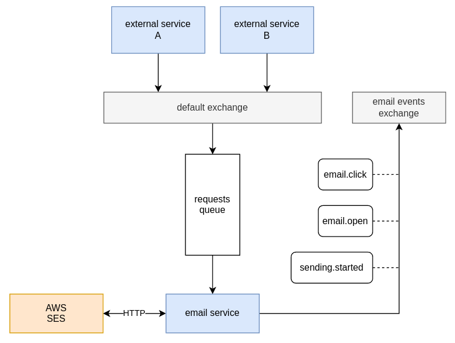

# Mailer

A simple email sending micro service, made for asynchronous and event based systems with Rabbitmq and AWS SES.

## Architecture

The service declares and consumes a single persistent queue, producers can send to the queue using a direct exchange or by declaring their own exchanges and binding them to said queue, although this would require the mailer queue to be declared beforehand.

this service declares and publishes events to a exchange so consumers can receive events such as when a email was sent, clicked, reported, etc.

## Known limitations

- SES Rate limiting for multiple instances of this service:

rate limiting for SES sendEmail operations is done in memory, this means rate limiting between multiple instances
of this service using the same SES account wont work and you should implement rate limiting that is shared by those
instances (eg: redis).

This should not be a problem since this service is a lightweight wrapper around SES and a 
single instance should be more than enough.

### [development setup](./docs/dev_setup.md)

### TODO
- document DTOS
